Чжан Жуйюй , 1 курс, ИВТ-1.2, группа Ⅱ


## 1.2: Сумма двух чисел

### Постановка задачи:

Написатьпростуюпрограмму.Ввестидвачисласклавиатуры,вычис
лить их суммуинапечататьрезультат. Использовать функцию printf
 для приглашений на ввод и для распечатки результата. Использовать
 функцию scanf для ввода каждого числа отдельно с клавиатуры. Для
 получения доступа к функциям printf и scanf включить в програм
му заголовочный файл stdio.h. Использовать корректные специфи
каторы форматирования. Здесь и далее для распечатки надписей на
 экране использовать латинские буквы для избежания проблем с ко
дировками символов.
 

### Математическая модель:sum=a+b

### Список идентификаторов:
| Имя переменной |Тип данных | Описание     |
| -------------- | --------- | ------------ |
| a              | float     | Первое число |
| b              | float     | Второе число |
| sum            | float     | Сумма чисел  |

```
#include <stdio.h>

int main() 
{
    float a, b, sum;
    printf("Enter first number: ");
    scanf("%f", &a);
    printf("Enter second number: ");
    scanf("%f", &b);
    sum = a + b;
    printf("Sum: %.2f\n", sum);
    return 0;
}
```
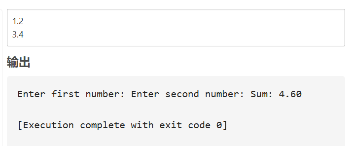


## 1.3: Вычисление выражения u(x,y) 

### Список идентификаторов:
| Имя переменной | Тип данных | Описание
| -------------- | ---------- | --------
| x              | double     | Аргумент x
| y              | double     | Аргумент y
| sin_xy         | double     | sin(x+y)
| numerator      | double     | Числитель выражения
| denominator    | double     | Знаменатель выражения
| result         | double     | Результат u(x,y)


```c
#include <stdio.h>
#include <math.h>

int main() 
{
    double x, y, sin_xy, numerator, denominator, result;\
    printf("Enter x: ");
    scanf("%lf", &x);
    printf("Enter y: ");
    scanf("%lf", &y);
    
    sin_xy = sin(x + y);
    numerator = 1 + pow(sin_xy, 2);
    denominator = 2 + fabs(x - (2 * pow(x, 2)) / (1 + fabs(sin_xy))); // 修复括号
    result = numerator / denominator;
    
    printf("u(x, y) = %.4f\n", result);
    return 0;
}
```


## 1.4: Вычисление h(x)

### Параметры:

1. a=0.12,b=3.5,c=2.4,x=1.4
2. a=0.12,b=3.5,c=2.4,x=1.6
3. a=0.27,b=3.9,c=2.8,x=1.8


$$  
h(x) = -\frac{x - a}{\sqrt[3]{x^2 + a^2}} - \frac{4\sqrt[3]{(x^2 + b^2)^3}}{2 + a + b + \sqrt[3]{(x - c)^2}}.  
$$  

```c
#include <stdio.h>
#include <math.h>

int main() 
{
    double a, b, c, x, h;
    
    // Первый случай (Case 1)
    a = 0.12; b = 3.5; c = 2.4; x = 1.4;
    h = -(x - a) / pow(x*x + a*a, 1.0/3.0) 
        - (4 * pow(x*x + b*b, 3.0/4.0)) 
        / (2 + a + b + pow((x - c)*(x - c), 1.0/3.0));
    printf("Case 1: h(x) = %.4f\n", h);
    
    // Второй случай (Case 2)
    x = 1.6;
    h = -(x - a) / pow(x*x + a*a, 1.0/3.0) 
        - (4 * pow(x*x + b*b, 3.0/4.0)) 
        / (2 + a + b + pow((x - c)*(x - c), 1.0/3.0));
    printf("Case 2: h(x) = %.4f\n", h);
    
    // Третий случай (Case 3)
    a = 0.27; b = 3.9; c = 2.8; x = 1.8;
    h = -(x - a) / pow(x*x + a*a, 1.0/3.0)
        - (4 * pow(x*x + b*b, 3.0/4.0)) 
        / (2 + a + b + pow((x - c)*(x - c), 1.0/3.0));
    printf("Case 3: h(x) = %.4f\n", h);
    
    return 0;
}
```

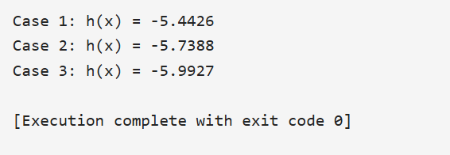


## 2.1:Координаты Марсa
**Постановка задачи**:

Вычислить координаты планеты Марс относительно Земли с течением времени t. 
Распечатать на экране координаты для каждой итерации по t. 

**Координаты Марса**: $x = r_1 \cos(\omega_1 t) - r_2 \cos(\omega_2 t)$, 
$y = r_1 \sin(\omega_1 t) - r_2 \sin(\omega_2 t)$.    

$$  
\begin{aligned}  
\omega_1 &= \frac{2\pi}{T_1}, \\  
\omega_2 &= \frac{2\pi}{T_2}, \\  
x &= r_1 \cos(\omega_1 t) - r_2 \cos(\omega_2 t), \\  
y &= r_1 \sin(\omega_1 t) - r_2 \sin(\omega_2 t).  
\end{aligned}  
$$  


**Список идентификаторов**:

| Имя переменной | Тип данных | Описание                     |
| -------------- | ---------- | ---------------------------- |
| r1             | double     | Радиус орбиты Марса (км)     |
| r2             | double     | Радиус орбиты Земли (км)     |
| T1             | double     | Период обращения Марса (дни  |
| T2             | double     | Период обращения Земли (дни) |
| t              | int        | Момент времени (дни)         |

```c
#include <stdio.h>  
#include <math.h>  

#define PI 3.1415926535  

int main() 
{  
    double r1 = 227.9e6;  // Радиус орбиты Марса (км)  
    double r2 = 149.6e6; // Радиус орбиты Земли (км)  
    double T1 = 687.0;   // Период обращения Марса (дни)  
    double T2 = 365.25;  // Период обращения Земли (дни)  
    int t_max = 10;      // Время в днях  

    for (int t = 0; t <= t_max; t++) 
    {  
        double w1 = 2 * PI / T1;  
        double w2 = 2 * PI / T2;  
        double x = r1 * cos(w1 * t) - r2 * cos(w2 * t);  
        double y = r1 * sin(w1 * t) - r2 * sin(w2 * t);  
        printf("t = %d дн: x = %.2f км, y = %.2f км\n", t, x, y);  
    }  
    return 0;  
}  
```
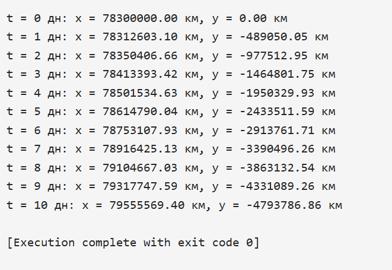


## 2.2: Интеграл методом трапеций

$$  
\int_a^b f(x) dx \approx \frac{h}{2} \left[ f(a) + f(b) \right] + h \sum_{i=1}^{n-1} f(a + i h), \quad h = \frac{b - a}{n}.  
$$  

**Список идентификаторов**:

| Имя переменной | Тип данных | Описание                      |
| -------------- | ---------- | ----------------------------- |
| a              | double     | Нижний предел интегрирования  |
| b              | double     | Верхний предел интегрирования |
| n              | int        | Количество интервалов         |
| h              | double     | Шаг интегрирования            |

```c
#include <stdio.h>  
#include <math.h>  

double f(double x) 
{  
    return exp(x + 2);  
}

int main() 
{  
    double a = 0.0, b = 1.0;  
    int n = 1000;  
    double h = (b - a) / n;  
    double sum = 0.5 * (f(a) + f(b));  

    for (int i = 1; i < n; i++) 
    {  
        sum += f(a + i * h);  
    }  
    sum *= h;  

    printf("∫₀¹ e^(x+2) dx ≈ %.6f\n", sum);  
    return 0;  
}  
```
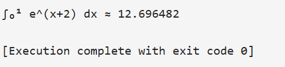


##  2.3: Числа Падована

**Постановка задачи**:

Распечатать последовательность чисел Падована, не превосходящих m. Формулы:
P(0)=P(1)=P(2)=1,P(n)=P(n−2)+P(n−3).

**Список идентификаторов**:

| Имя переменной | Тип данных | Описание       |
| -------------- | ---------- | -------------- |
| m              | int        | Верхний предел |
| p_prev3        | int        | P(n-3)         |
| p_prev2        | int        | P(n-2)         |


```c
#include <stdio.h>  

int main() 
{  
    int m;  
    printf("Введите m: ");  
    scanf("%d", &m);  

    int p_prev3 = 1, p_prev2 = 1, p_prev1 = 1;  
    printf("1 1 1 ");  

    for (int n = 3; ; n++) 
    {  
        int p = p_prev2 + p_prev3;  
        if (p > m) break;  
        printf("%d ", p);  
        p_prev3 = p_prev2;  
        p_prev2 = p_prev1;  
        p_prev1 = p;  
    }  
    return 0;  
}  
```
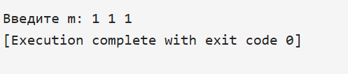


## 2.4: Сумма цифр трёхзначного числа

**Постановка задачи**:

Вводить трёхзначные числа до тех пор, пока сумма их цифр не станет ≤ 10.

**писок идентификаторов**:
| Имя переменной | Тип данных | Описание        |
| -------------- | ---------- | --------------- |
| num            | int        | Введённое число |
| sum            | int        | Сумма цифр      |


```c
#include <stdio.h>  

int main() 
{  
    int num, sum;  
    do 
    {  
        printf("Введите трёхзначное число: ");  
        scanf("%d", &num);  
        sum = (num / 100) + (num / 10 % 10) + (num % 10);  
    } while (sum > 10);  
    printf("Сумма цифр = %d. Программа завершена.\n", sum);  
    return 0;  
}  
```
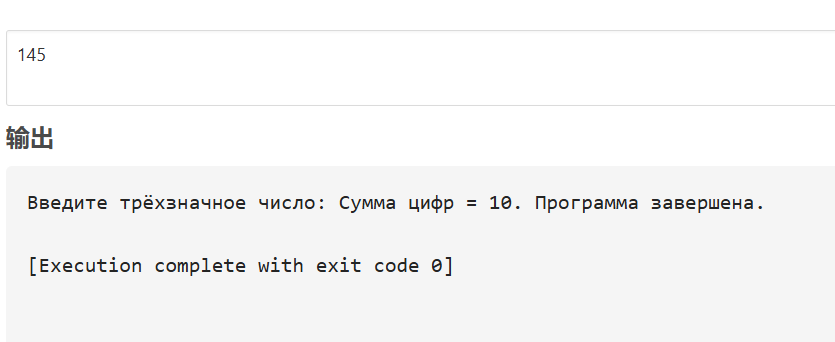


## 3.1: Вектор Y = X²

**Постановка задачи**:

Для вектора X, введённого с клавиатуры, вычислить Y=X⋅X.

**Список идентификаторов**:
| Имя переменной | Тип данных | Описание              |
| -------------- | -----------| ----------------------|
| x              | double[]   | Исходный вектор       |
| y              | double[]   | Результирующий вектор |


```c
#include <stdio.h>  
#define SIZE 5  

int main()
{  
    double X[SIZE], Y[SIZE];  
    printf("Введите %d элементов X: ", SIZE);  
    for (int i = 0; i < SIZE; i++) 
    {  
        scanf("%lf", &X[i]);  
        Y[i] = X[i] * X[i];  
    }  

    printf("Y = [");  
    for (int i = 0; i < SIZE; i++) printf("%.2f ", Y[i]);  
    printf("]\n");  
    return 0;  
}  
```
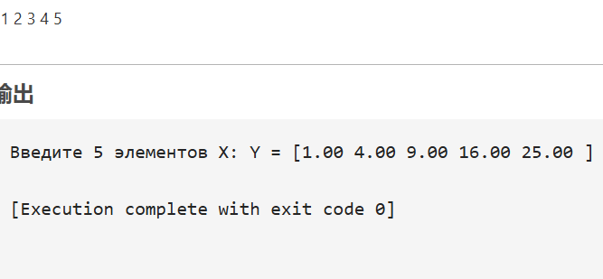


## 3.2: Обратный массив
**Постановка задачи**:
Изменить порядок элементов массива на обратный.

**Список идентификаторов**:
| Имя переменной | Тип данных | Описание        |
| -------------- | ---------- | --------------- |
| x              | int[]      | Исходный массив |

```c
#include <stdio.h>  
#define SIZE 5  

int main() 
{  
    int X[SIZE];  
    printf("Введите %d элементов: ", SIZE);  
    for (int i = 0; i < SIZE; i++) scanf("%d", &X[i]);  

    printf("Обратный массив: [");  
    for (int i = SIZE - 1; i >= 0; i--) printf("%d ", X[i]);  
    printf("]\n");  
    return 0;  
}  
```
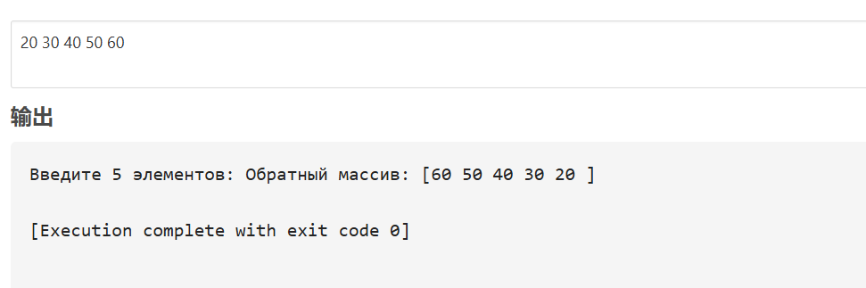


## 3.3: Транспонирование матрицы

**Постановка задачи**:
Транспонировать матрицу A.

**Список идентификаторов**:
| Имя переменной | Тип данных | Описание         |
| -------------- | ---------- | ---------------- |
| A              | int[][]    | Исходная матрица |


$$  
A = \begin{bmatrix}  
1 & 2 & 3 \\  
4 & 5 & 6 \\  
7 & 8 & 9  
\end{bmatrix}, \quad  
A^{\text{T}} = \begin{bmatrix}  
1 & 4 & 7 \\  
2 & 5 & 8 \\  
3 & 6 & 9  
\end{bmatrix}.  
$$  

```c
#include <stdio.h>  

int main() 
{  
    int A[3][3] = {{1,2,3}, {4,5,6}, {7,8,9}};  
    printf("Транспонированная матрица:\n");  
    for (int j = 0; j < 3; j++) 
    {  
        for (int i = 0; i < 3; i++) printf("%d ", A[i][j]);  
        printf("\n");  
    }  
    return 0;  
}  
```

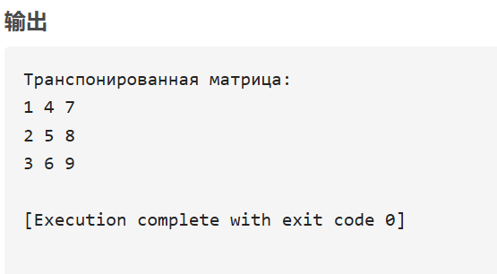


## 3.4: Замена первого элемента строки

**Постановка задачи**:
Заменить первый элемент каждой строки на среднее арифметическое элементов строки.

**Список идентификаторов**:
| Имя переменной | Тип данных | Описание               |
| -------------- | ---------- | ---------------------- |
| A              | float[][]  | Исходная матрица       |
| sum            | float      | Сумма элементов строки |

```c
#include <stdio.h>  

int main() 
{  
    float A[3][3] = {{1,2,3}, {4,5,6}, {7,8,9}};  
    for (int i = 0; i < 3; i++) 
    {  
        float sum = 0;  
        for (int j = 0; j < 3; j++) sum += A[i][j];  
        A[i][0] = sum / 3;  
    }  

    printf("Новая матрица:\n");  
    for (int i = 0; i < 3; i++) 
    {  
        for (int j = 0; j < 3; j++) printf("%.2f ", A[i][j]);  
        printf("\n");  
    }  
    return 0;  
}  
```

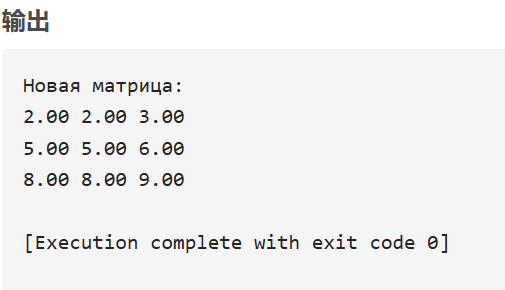


## 3.5: Сортировка вставками

**остановка задачи**:
Реализовать сортировку вставками для массива.

**Список идентификаторов**:
| Имя переменной | Тип данных |	Описание           |
| -------------- | ---------- | ------------------ |
| arr            | int[]	  | Сортируемый массив |
| key            | int	      | Текущий элемент    |


```c
#include <stdio.h>  
#define SIZE 5  

int main() 
{  
    int arr[SIZE] = {5, 2, 4, 6, 1};  
    for (int i = 1; i < SIZE; i++) 
    {  
        int key = arr[i];  
        int j = i - 1;  
        while (j >= 0 && arr[j] > key) 
        {  
            arr[j + 1] = arr[j];  
            j--;  
        }  
        arr[j + 1] = key;  
    }  

    printf("Отсортированный массив: [");  
    for (int i = 0; i < SIZE; i++) printf("%d ", arr[i]);  
    printf("]\n");  
    return 0;  
}  
```

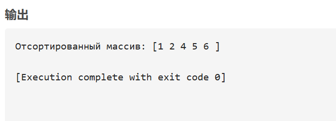
