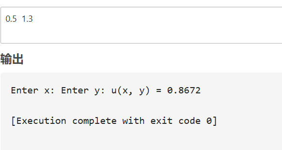

Чжан Жуйюй , 1 курс, ИВТ-1.2, группа Ⅱ


## 1.2: Сумма двух чисел

### Постановка задачи:

Написатьпростуюпрограмму.Ввестидвачисласклавиатуры,вычис
лить их суммуинапечататьрезультат. Использовать функцию printf
 для приглашений на ввод и для распечатки результата. Использовать
 функцию scanf для ввода каждого числа отдельно с клавиатуры. Для
 получения доступа к функциям printf и scanf включить в програм
му заголовочный файл stdio.h. Использовать корректные специфи
каторы форматирования. Здесь и далее для распечатки надписей на
 экране использовать латинские буквы для избежания проблем с ко
дировками символов.
 

### Математическая модель:sum=a+b

### Список идентификаторов:
| Имя переменной |Тип данных | Описание     |
| -------------- | --------- | ------------ |
| a              | float     | Первое число |
| b              | float     | Второе число |
| sum            | float     | Сумма чисел  |

```
#include <stdio.h>

int main() 
{
    float a, b, sum;
    printf("Enter first number: ");
    scanf("%f", &a);
    printf("Enter second number: ");
    scanf("%f", &b);
    sum = a + b;
    printf("Sum: %.2f\n", sum);
    return 0;
}
```


## 1.3: Вычисление выражения u(x,y) 

### Список идентификаторов:
| Имя переменной | Тип данных | Описание
| -------------- | ---------- | --------
| x              | double     | Аргумент x
| y              | double     | Аргумент y
| sin_xy         | double     | sin(x+y)
| numerator      | double     | Числитель выражения
| denominator    | double     | Знаменатель выражения
| result         | double     | Результат u(x,y)


```c
#include <stdio.h>
#include <math.h>

int main() 
{
    double x, y, sin_xy, numerator, denominator, result;\
    printf("Enter x: ");
    scanf("%lf", &x);
    printf("Enter y: ");
    scanf("%lf", &y);
    
    sin_xy = sin(x + y);
    numerator = 1 + pow(sin_xy, 2);
    denominator = 2 + fabs(x - (2 * pow(x, 2)) / (1 + fabs(sin_xy))); // 修复括号
    result = numerator / denominator;
    
    printf("u(x, y) = %.4f\n", result);
    return 0;
}
```




## 1.4: Вычисление h(x)

### Параметры:

1. a=0.12,b=3.5,c=2.4,x=1.4
2. a=0.12,b=3.5,c=2.4,x=1.6
3. a=0.27,b=3.9,c=2.8,x=1.8


$$  
h(x) = -\frac{x - a}{\sqrt[3]{x^2 + a^2}} - \frac{4\sqrt[3]{(x^2 + b^2)^3}}{2 + a + b + \sqrt[3]{(x - c)^2}}.  
$$  

```c
#include <stdio.h>
#include <math.h>

int main() 
{
    double a, b, c, x, h;
    
    // Первый случай
    a = 0.12; b = 3.5; c = 2.4; x = 1.4;
    h = -(x - a) / cbrt(pow(x, 2) + pow(a, 2)) 
        - (4 * cbrt(pow(pow(x, 2) + pow(b, 2), 3))) 
        / (2 + a + b + cbrt(pow(x - c, 2)));
    printf("Case 1: h(x) = %.4f\n", h);
    
    // Второй случай
    x = 1.6;\
    h = -(x - a) / cbrt(pow(x, 2) + pow(a, 2)) 
        - (4 * cbrt(pow(pow(x, 2) + pow(b, 2), 3)))
        / (2 + a + b + cbrt(pow(x - c, 2)));
    printf("Case 2: h(x) = %.4f\n", h);
    
    // Третий случай
    a = 0.27; b = 3.9; c = 2.8; x = 1.8;
    h = -(x - a) / cbrt(pow(x, 2) + pow(a, 2))
        - (4 * cbrt(pow(pow(x, 2) + pow(b, 2), 3)))
        / (2 + a + b + cbrt(pow(x - c, 2)));
    printf("Case 3: h(x) = %.4f\n", h);
    
    return 0;
}


