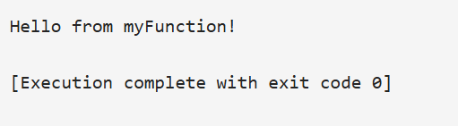
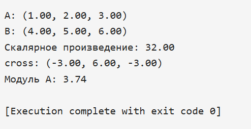

# Лабораторная работа 3

## Комплект 1: Структуры

## Задача 1.1

### Постановка задачи

Создать некоторую структуру с указателем на некоторую функцию в качестве поля. Вызвать эту функцию через имя переменной этой структуры и поле указателя на функцию.

### Список идентификаторов
| Имя переменной | Тип данных       | Описание             |           
|----------------|------------------|----------------------|
| func           | void (*)(void)   | Указатель на функцию |
| s	             | struct           | Экземпляр структуры  |


```c
#include <stdio.h>


typedef struct
{
    void (*func)(void); 
} MyStruct;


void myFunction()
{
    printf("Hello from myFunction!\n");
}

int main()
{
    MyStruct s;
    s.func = myFunction; 
    s.func(); 
    return 0;
}
```



## 1.2

### Постановка задачи

Создать структуру для вектора в 3-х мерном пространстве. Реализо-вать и использховать в своей программе следующие операции над векторами

| Имя переменной | Тип данных | Описание           |
| -------------- | ---------  | ------------------ |
| x, y, z        | float      | Координаты вектора |
| name           | char[]     | Имя вектора        |

``c
#include <stdio.h>
#include <math.h>
#include <string.h>

struct Vector3 
{
    char name[10];
    float x, y, z;
};

float dot(struct Vector3 a, struct Vector3 b) 
{
    return a.x*b.x + a.y*b.y + a.z*b.z;
}

struct Vector3 cross(struct Vector3 a, struct Vector3 b) 
{
    struct Vector3 result = {"cross", 
        a.y*b.z - a.z*b.y,
        a.z*b.x - a.x*b.z,
        a.x*b.y - a.y*b.x
    };
    return result;
}

float magnitude(struct Vector3 v) 
{
    return sqrt(v.x*v.x + v.y*v.y + v.z*v.z);
}

void print(struct Vector3 v) {
    printf("%s: (%.2f, %.2f, %.2f)\n", v.name, v.x, v.y, v.z);
}

int main() {
    struct Vector3 a = {"A", 1.0, 2.0, 3.0};
    struct Vector3 b = {"B", 4.0, 5.0, 6.0};
    print(a);
    print(b);

    printf("Скалярное произведение: %.2f\n", dot(a, b));
    print(cross(a, b));
    printf("Модуль A: %.2f\n", magnitude(a));
    return 0;
}
```


